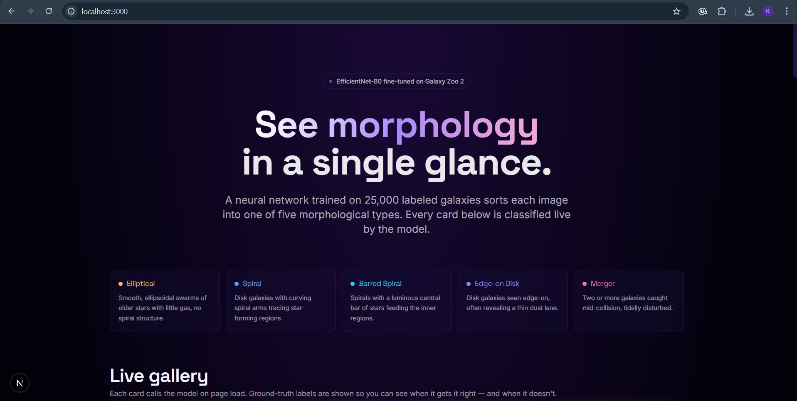
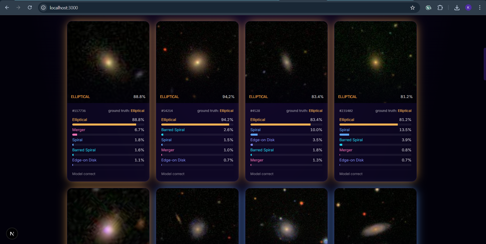
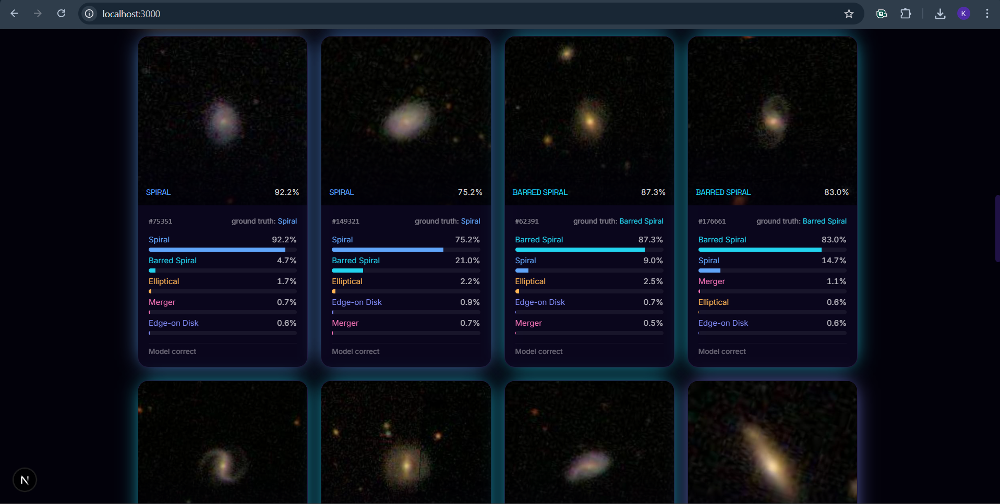
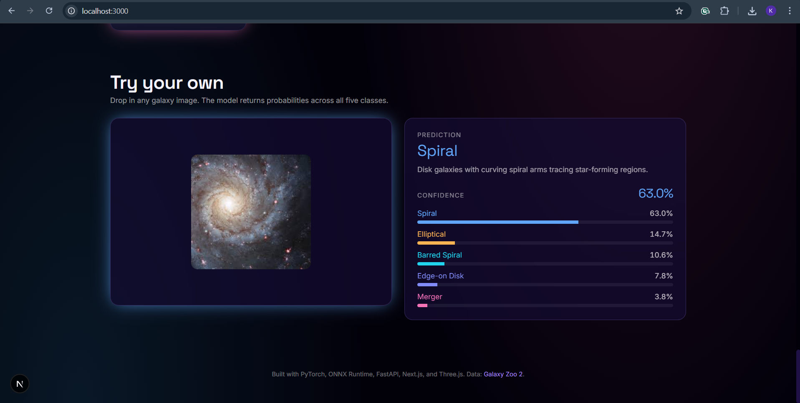

# Galaxy Classifier



A portfolio project that classifies galaxy morphology from a single image. A
fine-tuned EfficientNet-B0 trained on the Galaxy Zoo 2 dataset is served by a
FastAPI backend; the frontend is a Next.js + Three.js site that classifies a
curated gallery live on every page load and lets visitors upload their own
galaxy images.

## Screenshots

**Live gallery — every card is classified by the model on page load. The card border glows in the predicted class's color, and ground-truth labels are shown alongside the model's verdict so you can see when it agrees and when it doesn't.**





**Upload your own galaxy image — the model returns probabilities across all five classes with a written description of the predicted morphology.**



## Five classes

| Class           | Color  |
|-----------------|--------|
| Elliptical      | orange |
| Spiral          | blue   |
| Barred Spiral   | cyan   |
| Edge-on Disk    | indigo |
| Merger          | pink   |

Held-out test accuracy: **78.9%** (per-class: edge-on 93.4%, merger 85.6%,
elliptical 82.6%, barred 69.4%, spiral 64.4%). Spiral ↔ barred-spiral is the
expected hard split since bars can be subtle even for human classifiers.

## Repo layout

```
galaxy-classification/
  ml/                       # training pipeline (see ml/README inline in scripts)
    class_map.py            # 5-class labeling logic over Galaxy Zoo 2 codes
    prepare_data.py         # join labels + mapping, balance, train/val/test splits
    dataset.py              # PyTorch Dataset that streams images from the zip
    train.py                # EfficientNet-B0 transfer learn + ONNX export
    colab_train.ipynb       # GPU training wrapper for Colab
    build_gallery.py        # picks ~25 curated images for the website
    verify_onnx.py          # sanity check the exported ONNX model
    artifacts/              # trained weights + ONNX export
  api/                      # FastAPI service
    main.py                 # /health, /gallery, /predict, /predict-gallery/<f>
    model.py                # ONNX inference wrapper with training-matched preprocess
    requirements.txt
  web/                      # Next.js + TS + Tailwind frontend
    app/
    components/
    lib/
    public/gallery/         # 25 curated JPGs surfaced as the live gallery
  data/                     # NOT in git — populated by the user
    raw/
      gz2_hart16.csv.gz
      gz2_filename_mapping.csv
      images_gz2.zip
    processed/              # produced by ml/prepare_data.py
      train.csv
      val.csv
      test.csv
```

## Setup

### One-time

```powershell
pip install -r api/requirements.txt
pip install torch torchvision pandas tqdm scikit-learn onnxscript

cd web
npm install
cd ..
```

### Download the dataset (~3.3 GB)

Place these files in `data/raw/`:

- `images_gz2.zip` from [Zenodo 3565489](https://zenodo.org/records/3565489)
- `gz2_filename_mapping.csv` from the same Zenodo record
- `gz2_hart16.csv.gz` from https://data.galaxyzoo.org/

### Train

```powershell
python ml/prepare_data.py     # produces data/processed/{train,val,test}.csv
```

Then either upload the folder to Google Drive and run `ml/colab_train.ipynb` on
a Colab T4 GPU (~30 min), or train locally on CPU (slow, ~6 hr/epoch):

```powershell
python ml/train.py --epochs 8 --batch-size 32 --workers 4
```

Either path writes `ml/artifacts/galaxy_classifier.onnx` and `best.pt`.

### Build the gallery

After training, pick a curated set of demo galaxies:

```powershell
python ml/build_gallery.py
```

This writes ~25 JPGs to `web/public/gallery/` and a manifest at
`web/public/gallery.json`.

## Run

Two terminals — both stay running:

```powershell
# Terminal 1 — API
python -m uvicorn api.main:app --port 8000 --reload

# Terminal 2 — Frontend
cd web
npm run dev
```

Open http://localhost:3000.

## How it works

1. **Training preprocessing**: center-crop to 212×212 (the inner half of GZ2's
   424×424 frames where the galaxy sits), resize to 224×224, ImageNet
   normalize. Augmentation is rotation/flip — galaxies have no canonical
   orientation.
2. **Inference preprocessing** (in `api/model.py`) matches training exactly so
   user uploads of arbitrary sizes are funneled into the same effective view
   the model was trained on.
3. **Gallery cards** call `/predict-gallery/<filename>` from the browser on
   mount, staggered by ~120 ms each so the page doesn't fire 25 requests
   simultaneously. Probability bars animate in via Framer Motion. The card
   border glows in the predicted class's color.
4. **Upload zone** accepts drag-drop or click, sends to `/predict` as
   multipart/form-data, displays the top class with description and a stack
   of probability bars.

## Notes

- The 3.2 GB image zip is never extracted; both training and gallery-building
  stream JPGs directly out of the zip via `zipfile`.
- The ONNX export uses opset 17 + `dynamo=False` to avoid the new exporter's
  Unicode print statements which crash on Windows cp1252 consoles.
- CORS in `api/main.py` only allows `localhost:3000` and `127.0.0.1:3000`.
  Add deployment origins there if you put this online.
